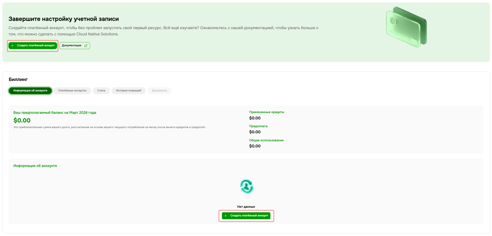
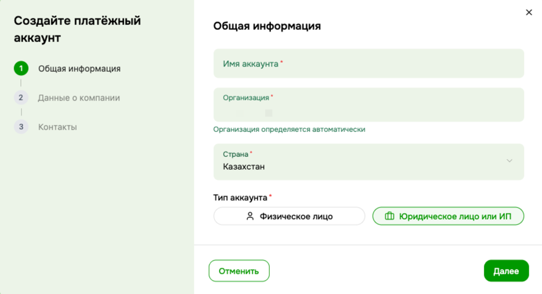
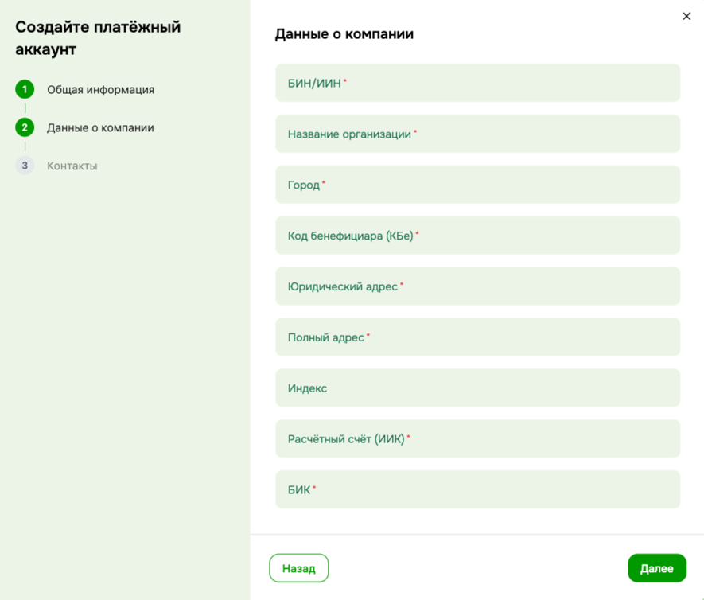
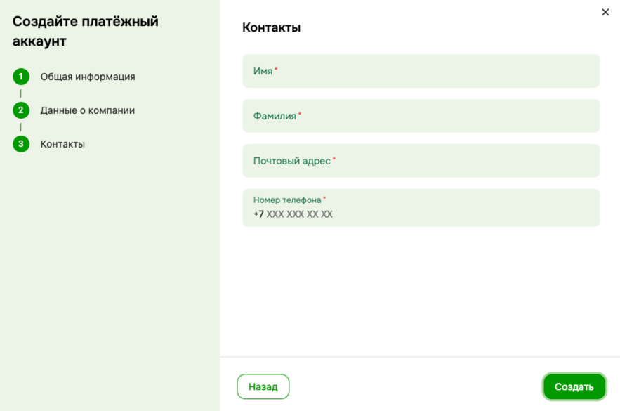
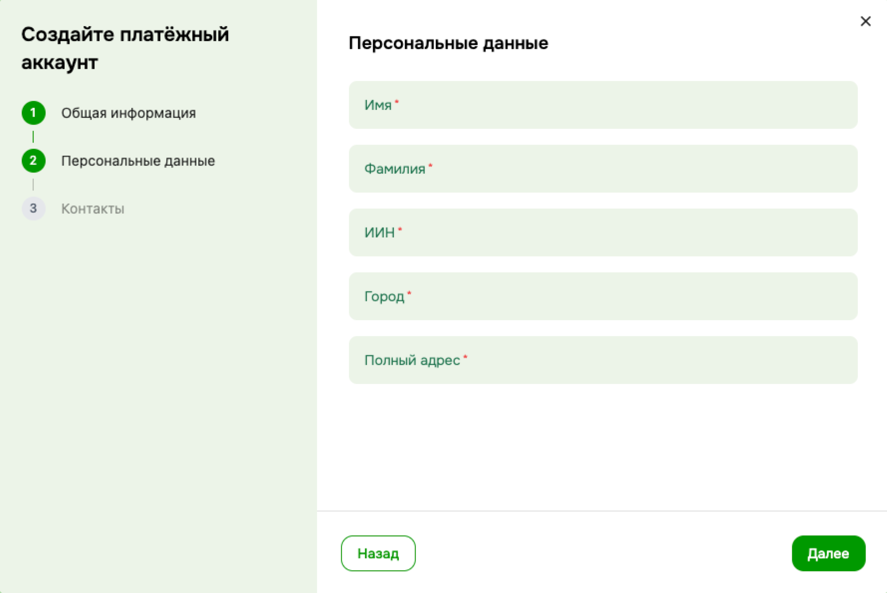
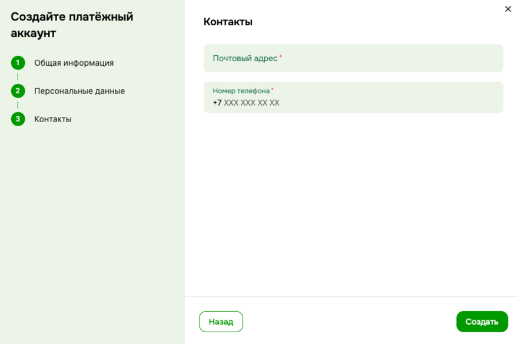
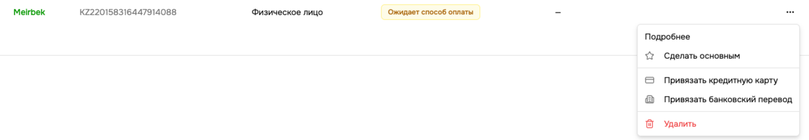

# Creating a Billing Account

New users do not have a Billing Account — you need to create one before using paid services.

Go to **Billing → Payment Accounts** and click **Create Account**.

---

## Step 1 — General Information

The first step is the same for both account types.

| Field | Description |
|---|---|
| **Account Name** | Display name for the billing account |
| **Organization** | Determined automatically from your current organization |
| **Country** | Country of the payer |
| **Account Type** | Individual or Legal Entity / Sole Proprietor |

Select the account type and click **Next**.

> **Important for legal entities:** registering as a legal entity is required to receive official invoices, acts of work, and for formal document flow. Legal entities also have access to extended platform capabilities and terms.

---

## Legal Entity / Sole Proprietor

### Step 2 — Company Details

| Field | Description |
|---|---|
| **BIN/IIN** | Business Identification Number of the company |
| **Organization Name** | Official company name |
| **City** | City of business |
| **Beneficiary Code (KBe)** | Beneficiary code for banking operations |
| **Legal Address** | Official registered address of the company |
| **Full Address** | Actual address of the company |
| **Postal Code** | Postal code (optional) |
| **Settlement Account (IIK)** | Company bank account number |
| **BIC** | Bank Identification Code |

Click **Next**.

### Step 3 — Contacts

| Field | Description |
|---|---|
| **First Name** | Contact person's first name |
| **Last Name** | Contact person's last name |
| **Email** | Contact email address |
| **Phone Number** | Used exclusively for emergency contact — critical infrastructure incidents, security events, or urgent billing issues |

Click **Create**.

---

## Individual

### Step 2 — Personal Details

| Field | Description |
|---|---|
| **First Name** | Payer's first name |
| **Last Name** | Payer's last name |
| **IIN** | Individual Identification Number |
| **City** | City of residence |
| **Full Address** | Billing address |

Click **Next**.

### Step 3 — Contacts

| Field | Description |
|---|---|
| **Email** | Contact email address |
| **Phone Number** | Used exclusively for emergency contact — critical infrastructure incidents, security events, or urgent billing issues |

Click **Create**.

---

## Payment Method

After creating the account, add a payment method:

- **Bank Card** — available immediately. Link your card in **Billing → Account Information**.
- **Bank Transfer** — pay by invoice. To enable this, you will need to upload company registration documents. This feature is **currently in development** and will be available soon. It is required to verify that the account is genuinely registered under the company, and for issuing invoices and acts of work.

---

> **Need help?** Open a ticket in the [Support](https://console.cloud-native.kz/support) section.
