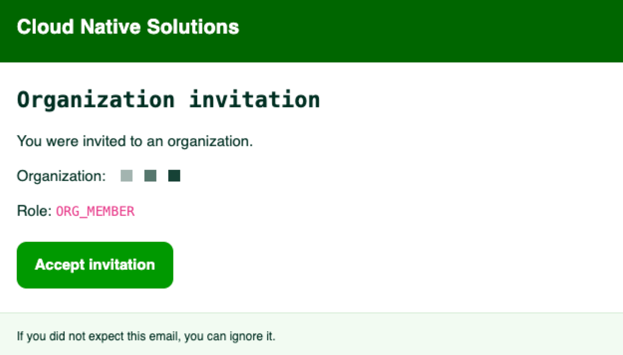
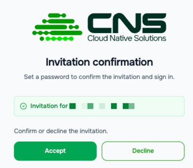
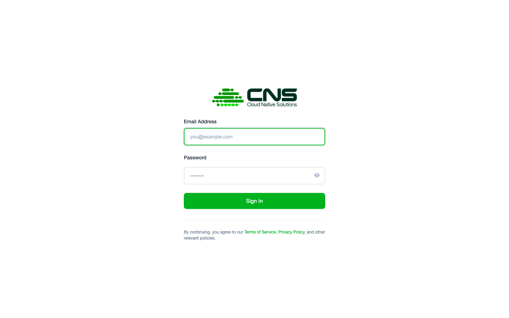

# Getting Started with Cloud Native Solutions

Cloud Native Solutions is a managed cloud platform for businesses and teams. This guide walks you through the entire onboarding process: from receiving your invitation to logging into the console and getting started.

---

## Table of Contents

1. [How Access Works](#1-how-access-works)
2. [Registration](#2-registration)
3. [Logging In](#3-logging-in)
4. [First Login to the Console](#4-first-login-to-the-console)

---

- [Console Overview](./console-overview.md) — navigate the console interface
- [First Steps After Login](./first-steps.md) — recommended actions after your first login
- [Glossary](./glossary.md) — terms and definitions

---

## 1. How Access Works

Cloud Native Solutions uses **invitation-based registration**. There is no open self-service sign-up.

This is intentional: the platform is designed for businesses and teams that need a managed, secure cloud environment. Access is currently available through limited testing and demo access for partners. Public self-service registration is planned for the future.

Each new account is tied to an **Organization** — a workspace that groups your team, projects, services, and billing. Before you can start, our team reviews your request and sends you a personal invitation.

**How to get access:**

1. Contact the Cloud Native Solutions team or your account manager to request access.
2. You will receive an invitation email at the address you provided.
3. Follow the link in the email to complete your registration.



> **Note:** Invitation links are single-use and expire after a limited period. If your link has expired, email [cns-support@fcd.kz](mailto:cns-support@fcd.kz) to request a new one.

---

## 2. Registration

When you follow the invitation link, you will be taken to the account creation page at `console.cloud-native.kz`.



**Steps:**

1. Confirm or decline the invitation.
2. After confirming, you will be taken to a form where you need to set a password.
3. Create a **new password** for your account.
4. Confirm the password.
5. Click **Complete Registration**.

After successful registration you will be automatically redirected to the console.

---

## 3. Logging In

To log in to the console, go to:

```
https://console.cloud-native.kz
```

You will be redirected to the authentication page at `auth.cloud-native.kz`.



**Steps:**

1. Enter your **email address** in the username field.
2. Enter your **password**.
3. Press **Enter**.

After successful authentication you will be redirected to the console.

> **Forgot your password?** Email [cns-support@fcd.kz](mailto:cns-support@fcd.kz) — the support team will help you regain access.

---

## 4. First Login to the Console

After logging in you will land on the **Dashboard** — the main screen of the console.

At this point you are inside your **Organization**. The organization is created automatically when you register. To switch between organizations or view the current one, use the **dropdown menu in the top-right corner** of the screen.

<!-- screenshot: console dashboard (in development) -->

Before using paid services, you need to **create a Billing Account** (see [Creating a Billing Account](../billing/setup.md)).

---

> **Need help?** Open a ticket in the [Support](https://console.cloud-native.kz/support) section or email [cns-support@fcd.kz](mailto:cns-support@fcd.kz).
