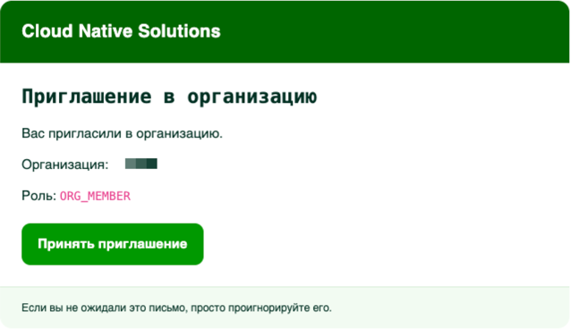

# Начало работы с Cloud Native Solutions

Cloud Native Solutions — управляемая облачная платформа для бизнеса и команд. Этот документ проведёт вас через весь путь первого доступа: от получения приглашения до входа в консоль и начала работы в системе.

---

## Содержание

1. [Как устроен доступ к платформе](#1-как-устроен-доступ-к-платформе)
2. [Регистрация](#2-регистрация)
3. [Вход в систему](#3-вход-в-систему)
4. [Первый вход в консоль](#4-первый-вход-в-консоль)
5. [Глоссарий](#5-глоссарий)

---

→ Чтобы ознакомиться с интерфейсом консоли, перейдите в раздел [Ориентация в консоли](./console-overview.md).
→ Рекомендуемые первые шаги после входа описаны в разделе [Первые шаги после входа](./first-steps.md).

---

## 1. Как устроен доступ к платформе

Cloud Native Solutions использует **регистрацию по приглашению**. Открытой самостоятельной регистрации нет.

Это сделано намеренно: платформа предназначена для бизнеса и команд, которым нужна управляемая и безопасная облачная среда. В настоящее время доступ открыт в рамках тестирования и ограниченного демо-доступа для партнёров. В будущем планируется переход к открытой публичной регистрации.

Каждый новый аккаунт связан с **Организацией** — рабочим пространством, которое объединяет вашу команду, проекты, сервисы и биллинг. Прежде чем вы сможете начать работу, наша команда рассматривает вашу заявку и отправляет персональное приглашение.

**Как получить доступ:**

1. Свяжитесь с командой Cloud Native Solutions или вашим менеджером, чтобы запросить доступ.
2. На указанный вами адрес электронной почты придёт письмо с приглашением.
3. Перейдите по ссылке в письме, чтобы завершить регистрацию.



> **Обратите внимание:** Ссылки-приглашения одноразовые и имеют ограниченный срок действия. Если ссылка истекла, обратитесь в поддержку для получения новой.

---

## 2. Регистрация

Когда вы переходите по ссылке из письма-приглашения, вы попадаете на страницу создания аккаунта на `console.cloud-native.kz`.


**Порядок действий:**

1. Подтверждаете либо отклоняете приглашение.
2. После подтверждения, переходите на форму, где надо задать пароль.
3. Создайте **новый пароль** для вашего аккаунта.
4. Подтвердите пароль.
5. Нажмите **Завершить регистрацию**.

После успешной регистрации вы будете автоматически перенаправлены в консоль.

---

## 3. Вход в систему

Для входа в консоль перейдите по адресу:

```
https://console.cloud-native.kz
```

Вы будете перенаправлены на страницу аутентификации `auth.cloud-native.kz`.


**Порядок действий:**

1. Введите ваш **адрес электронной почты** в поле имени пользователя.
2. Введите ваш **пароль**.
3. Нажмите **Enter**.

После успешной аутентификации вы будете перенаправлены на главный экран консоли.

> **Если вы забыли пароль:** напишите на [cns-support@fcd.kz](mailto:cns-support@fcd.kz) — команда поддержки поможет восстановить доступ.

---

## 4. Первый вход в консоль

После первого входа вы попадёте на **Дашборд** — главный экран консоли.

На этом этапе вы находитесь внутри своей **Организации**. Организация автоматически создаётся при регистрации. Переключиться между организациями или посмотреть текущую можно через **выпадающее меню в правом верхнем углу** экрана.

<!-- скриншот: дашборд консоли (в разработке) -->

Прежде чем использовать платные сервисы, необходимо **создать Платёжный аккаунт** (см. [Создание платёжного аккаунта](../billing/setup.md)).

---

## 5. Глоссарий

| Термин | Определение |
|---|---|
| **Организация** | Основная сущность верхнего уровня, которая объединяет всех участников команды, проекты, сервисы и биллинг. Каждый аккаунт принадлежит одной или нескольким Организациям. |
| **Проект** | Логическая группировка облачных ресурсов внутри Организации. Используется для разделения окружений (например, продакшн и стейджинг) или команд. |
| **Владелец** | Роль в организации с полными административными правами. В организации должен быть как минимум один Владелец. |
| **Администратор** | Роль в организации, позволяющая управлять биллингом, приглашать участников и настраивать проекты. |
| **Участник** | Роль в организации с доступом к ресурсам в соответствии с настройками Администратора. |
| **Платёжный аккаунт** | Финансовый профиль, привязанный к вашей Организации. Содержит данные плательщика, способ оплаты и историю транзакций. |
| **Способ оплаты** | Метод, которым списываются средства за использование платформы. Доступные варианты: банковская карта и банковский перевод (в разработке). |
| **Физическое лицо** | Тип платёжного аккаунта для частных пользователей. |
| **Юридическое лицо** | Тип платёжного аккаунта для компаний (ТОО, АО и др.). Необходим для выставления официальных счетов, актов выполненных работ и доступа к корпоративным условиям платформы. |
| **Токен персонального доступа** | Учётные данные для программного доступа к API. Используются вместо логина и пароля при API-запросах. |
| **CDN** | Content Delivery Network (сеть доставки контента) — распределённая сеть серверов, которая доставляет контент пользователям с ближайшего географического узла. |
| **HCI** | Hyper-Converged Infrastructure (гиперконвергентная инфраструктура) — унифицированная система вычислений, хранения и сети. Используется в Sangfor. |
| **Регистрация по приглашению** | Модель доступа, при которой новые пользователи могут зарегистрироваться только после получения персональной ссылки-приглашения. |

---

> **Нужна помощь?** Создайте тикет в разделе [Поддержка](https://console.cloud-native.kz/support).
