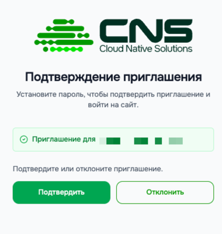
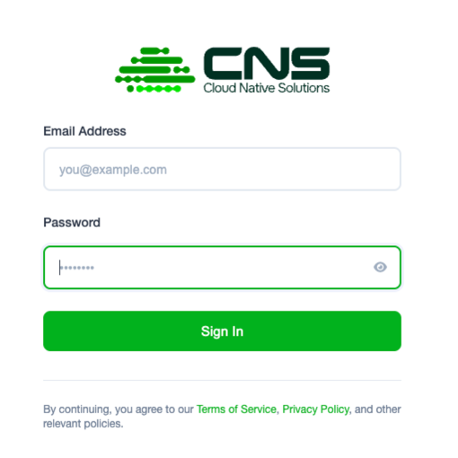

# Начало работы с Cloud Native Solutions

Cloud Native Solutions — управляемая облачная платформа для бизнеса и команд. Этот документ проведёт вас через весь путь первого доступа: от получения приглашения до входа в консоль и начала работы в системе.

---

## Содержание

1. [Как устроен доступ к платформе](#1-как-устроен-доступ-к-платформе)
2. [Регистрация](#2-регистрация)
3. [Вход в систему](#3-вход-в-систему)
4. [Первый вход в консоль](#4-первый-вход-в-консоль)

---

- [Ориентация в консоли](ориентация-в-консоли-cloud-native-solutions.md) — знакомство с интерфейсом консоли
- [Первые шаги после входа](первые-шаги-после-входа-в-cloud-native-solutions.md) — рекомендуемые действия после первого входа
- [Глоссарий](./глоссарий.md) — термины и определения

---

## 1. Как устроен доступ к платформе

Cloud Native Solutions использует **регистрацию по приглашению**. Открытой самостоятельной регистрации нет.

Это сделано намеренно: платформа предназначена для бизнеса и команд, которым нужна управляемая и безопасная облачная среда. В настоящее время доступ открыт в рамках тестирования и ограниченного демо-доступа для партнёров. В будущем планируется переход к открытой публичной регистрации.

Каждый новый аккаунт связан с **Организацией** — рабочим пространством, которое объединяет вашу команду, проекты, сервисы и биллинг. Прежде чем вы сможете начать работу, наша команда рассматривает вашу заявку и отправляет персональное приглашение.

**Как получить доступ:**

1. Свяжитесь с командой Cloud Native Solutions или вашим менеджером, чтобы запросить доступ.
2. На указанный вами адрес электронной почты придёт письмо с приглашением.
3. Перейдите по ссылке в письме, чтобы завершить регистрацию.


> **Обратите внимание:** Ссылки-приглашения одноразовые и имеют ограниченный срок действия. Если ссылка истекла, напишите на [cns-support@fcd.kz](mailto:cns-support@fcd.kz) для получения новой.

---

## 2. Регистрация

Когда вы переходите по ссылке из письма-приглашения, вы попадаете на страницу создания аккаунта на `console.cloud-native.kz`.



**Порядок действий:**

1. Подтверждаете либо отклоняете приглашение.
2. После подтверждения, переходите на форму, где надо задать пароль.
3. Создайте **новый пароль** для вашего аккаунта.
4. Подтвердите пароль.
5. Нажмите **Завершить регистрацию**.

После успешной регистрации вы будете автоматически перенаправлены в консоль.

---

## 3. Вход в систему

Для входа в консоль перейдите по адресу:

```
https://console.cloud-native.kz
```

Вы будете перенаправлены на страницу аутентификации `auth.cloud-native.kz`.



**Порядок действий:**

1. Введите ваш **адрес электронной почты** в поле имени пользователя.
2. Введите ваш **пароль**.
3. Нажмите **Enter**.

После успешной аутентификации вы будете перенаправлены на главный экран консоли.

> **Если вы забыли пароль:** напишите на [cns-support@fcd.kz](mailto:cns-support@fcd.kz) — команда поддержки поможет восстановить доступ.

---

## 4. Первый вход в консоль

После первого входа вы попадёте на **Дашборд** — главный экран консоли.

На этом этапе вы находитесь внутри своей **Организации**. Организация автоматически создаётся при регистрации. Переключиться между организациями или посмотреть текущую можно через **выпадающее меню в правом верхнем углу** экрана.

<!-- скриншот: дашборд консоли (в разработке) -->

Прежде чем использовать платные сервисы, необходимо **создать Платёжный аккаунт** (см. [Создание платёжного аккаунта](../биллинг/создание-платежного-аккаунта.md)).

---

> **Нужна помощь?** Создайте тикет в разделе [Поддержка](https://console.cloud-native.kz/support) или напишите на [cns-support@fcd.kz](mailto:cns-support@fcd.kz).
